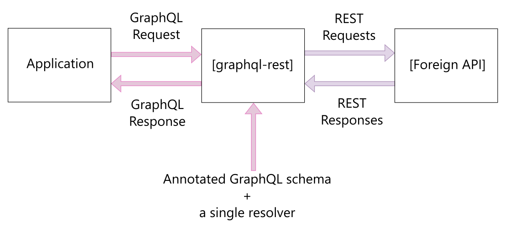

  

# graphql-rest

Because programming with REST APIs is so boringly slow, and because GraphQL
APIs are so Great!

This module allows to factor out all your GraphQL resolvers into a single one,
thanks to GraphQL directives (aka. GraphQL annotations). It uses the
graphql-tools module from the Apollo GraphQL project to parse the schema.

## How it works

graphql-rest can be used both **server-side**, to exhibit a GraphQL API, or
**client-side**, to be able to consume a Rest API as if it was a GraphQL one.

## Get started

Do one of:

- Create your GraphQL schema using the online [graphql-rest playground]()
- Add graphql-rest as a backend module following the [guide for backend]()
- Add graphql-rest as a frontend module the [guide for frontend]()
- Run the graphql-rest playground locally following the [playground setup guide]()

## Documentation

The documentation can be [read on github](https://github.com/graphql-rest/graphql-rest/tree/master/doc).

## Features

## Development

1. [ ] End to end (functional) tests
1. [ ] Unit tests
1. [ ] Mutation queries
1. [ ] Documented way to use the library outside of development context
1. [ ] Documented way to make a GraphQL use as a library
1. [ ] Support for custom annotations with altered behaviour
1. [ ] Support for GraphQL resolving list types from argument lists stacked type modifier, such as `[[ID]]` , `[ID!]` , `[ID]!` , `[[[ID!]!]!]!`
1. [ ] Possibility to specify a property to use as root in the JSON response rather the JSON root
1. [ ] Possibility to specify a property to check for errors in the JSON response1. [ ] Ability to specify a JSON path to a `root` field in the JSON response
1. [ ] Ability to access JSON nested properties when renaming a property
1. ~~[ ] Configure the syntax for argument replacement `"{x}/(y)/()"`~~

   Having multiple syntaxes or customisable syntaxes is a bad idea.
