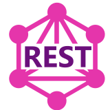
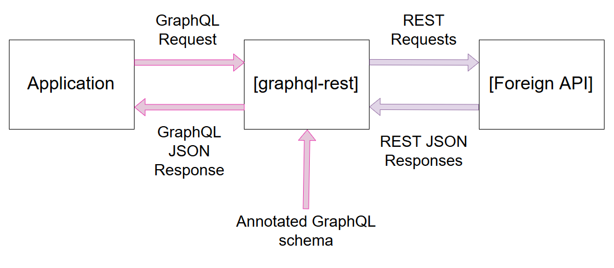

[](https://github.com/graphql-rest/graphql-rest)

# graphql-rest

Because programming with REST APIs is so boringly slow, and because GraphQL
APIs are so Great!

This module allows you to GraphQL-ify any (json) REST API by writing only
GraphQL. This is possible thanks to GraphQL directives (aka. GraphQL
annotations), and made easy to implement by the graphql-tools module from the
Apollo GraphQL project.

## How it works



## Write your GraphQL schema

### 1. Add the library to your JS / TS project

With yarn / npm:

```sh
yarn add graphql-rest fetch
npm install --save graphql-rest fetch
```

You'll want to use apollo-server and nodemon for a greater GraphQL development
experience. Install them with one of:

```sh
yarn add --dev apollo-server nodemon
npm install --save-dev apollo-server nodemon
```

### 2. Instantiate GraphqlRest

A. Create `mySchema.gql`

```gql
type Query {
  hello: Int
}
```

B. Create `server.js` and add:

B1. the code which imports the dependencies (choose your import style):

- commonjs style, if you use vanilla nodejs:

```ts
const { readFileSync } = require('fs')

const fetch = require('node-fetch')
const { ApolloServer } = require('apollo-server')
const { GraphqlRest } = require('graphql-rest')
```

- es6 style:

```ts
import { readFileSync } from 'fs'

import fetch from 'node-fetch'
import { ApolloServer } from 'apollo-server'
import { GraphqlRest } from 'graphql-rest'
```

B1. the code which starts the server:

```ts
const PORT = 4000

let myApiGraphqlSchema = readFileSync(`${__dirname}/mySchema.gql`, 'utf-8')

let myGraphqlApi = new GraphqlRest(myApiGraphqlSchema, { fetch })

let { schema } = myGraphqlApi

let server = new ApolloServer({
  schema,
})

server.listen({ port: PORT }).then(() => {
  console.log(
    `Serving the GraphQL Playground on http://localhost:${PORT}/playground`,
  )
})
```

C. Run the Apollo Server with nodemon (replace `yarn` by `npm run` if you use npm):

```sh
yarn nodemon --ext .gql server.js
```

You will get an output like:

```txt
[nodemon] 1.19.1
[nodemon] to restart at any time, enter `rs`
[nodemon] watching: *.*
[nodemon] starting `node server.js`
Serving the GraphQL Playground on http://localhost:4000/playground
```

Open your browser to http://localhost:4000/playground, where the GraphQL playground runs.

Note:
If you are going to be using GraphqlRest in a web browser, consider using node
while developing the GraphQL schaema for the API.

### 3. Develop your annotated GraphQL Schema

Start editing `mySchema.gql`. Add the `@from` directive header, add the
`@from(configUrlBase: "...")` configuration, and put
`@from(get: "url_end_with_where/:x/will_be_substituted")`

```gql
# This header declares the `from` directive that GraphqlRest implements
directive @from(
  "Config"
  configUrlBase: String
  "Rename a REST result property"
  prop: String
  "REST calls"
  get: String
  delete: String
  patch: String
  post: String
  put: String
  "Specify a path to the property in the JSON result to use as field value"
  root: String
) on OBJECT | FIELD_DEFINITION
# Passing { addHeader: true } allows to omit the header, but is not recommended
# if you are going to use any GraphQL linting tool, as the GraphQL specification
# requires declaring the directives you use

# Using @from(get) allows you to specify the URL and REST method to use for the
# resolver. Any word preceded by `:` will undergo substitution
# A word is /[A-Za-z_]+/
type Query @from(configUrlBase: "https://myApiUrlBase.org/v2/") {
  image(id: ID!): Image @from(get: "/:id.json")
  user(name: ID!): User @from(get: "/profiles/:name.json")
  search(
    query: String!
    sort: SortFieldInput = created_at
    page: Int = 1
    perpage: Int = 15
  ): SearchPage!
    @from(get: "/search.json?q=:query&sf=:sort&page=:page&perpage=:perpage")
}

scalar Date
scalar Url

enum SortFieldInput {
  created_at
  score
  random
}

# Here things get interesting, see the substitution is not only possible with
# GraphQL arguments, but also with the values returned from the REST API call.
# If you are familiar with GraphQL resolvers, here `:uploader_id` is found in
# the `parent` (or `source` ) field of the resolver. This is what enables the
# nesting power of GraphQL
type Image {
  description: String
  score: Int!
  url: Url
  updated_at: Date!
  uploader_id: ID
  uploader_info: User @from(get: "/profiles/:uploader_id.json")
}

type SearchPage {
  search: [Image!]!
  total: Int!
}

type User {
  id: ID
  name: String!
  images(
    sort: SortFieldInput = created_at
    page: Int = 1
    perpage: Int = 50
  ): SearchPage
    @from(
      get: "/search.json?q=uploader_id%3A:id&sf=:sort&page=:page&perpage=:perpage"
    )
}
```

## Development

### Done

1. [x] Ability to rename a REST property via annotation
1. [x] Document the other useful properties of GraphqlRest instances
1. [x] Document the lesser useful properties of GraphqlRest instances
1. [x] Document the lesser useful features of GraphqlRest schemas
1. [x] SWAPI (Star Wars API) example

### Coming soon

1. [ ] Configure the syntax for argument replacement `"{x}/[y]"`
1. [ ] Unit tests
1. [ ] Mutation queries
1. [ ] End to end (functional) tests
1. [ ] Documented way to use the library outside of development context
1. [ ] Documented way to make a GraphQL use as a library
1. [ ] Support for custom annotations with altered behaviour
1. [ ] Support for GraphQL resolving list types from argument lists stacked type modifier, such as `[[ID]]` , `[ID!]` , `[ID]!` , `[[[ID!]!]!]!`
1. [ ] Possibility to specify a property to use as root in the JSON response rather the JSON root
1. [ ] Possibility to specify a property to check for errors in the JSON response

###

### Not coming until someone requests it

1. [ ] Ability to specify a JSON path to a `root` field in the JSON response
1. [ ] Ability to access JSON nested properties when renaming a property
